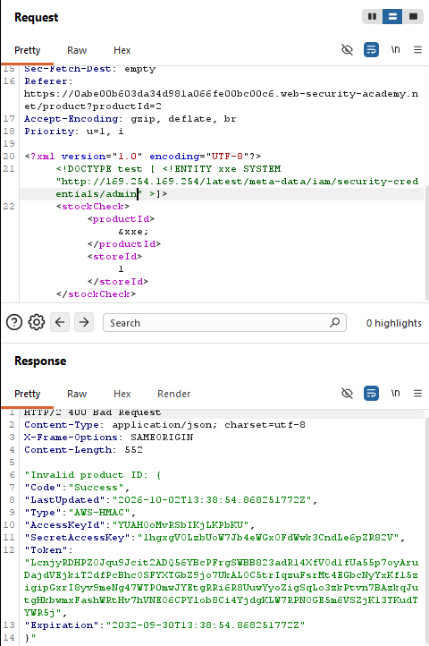
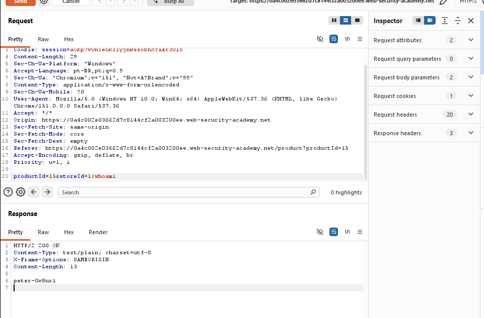

# Guia de uso do Burp Suite — CORS, XXE e OS Command Injection

> Baseado nos labs resolvidos na Web Security Academy (PortSwigger) em 02/10/2026.

Este guia explica, na prática, como as ferramentas do Burp Suite (**Proxy**, **Repeater** e **Intruder**) foram usadas para identificar e explorar três classes de vulnerabilidade: CORS mal configurado, XXE e OS Command Injection.

---

## 1. Proxy — interceptando o tráfego

O **Proxy** é o ponto de entrada do Burp: ele fica entre o navegador e o servidor, capturando todas as requisições e respostas HTTP. É através dele que conseguimos "ver" o que a aplicação está realmente enviando, antes de decidir o que modificar.

Fluxo usado em todos os labs:
1. Navegador configurado para usar o Burp como proxy (ou usando o navegador embutido do Burp).
2. Realizar a ação normal na aplicação (fazer login, clicar em "Check stock", abrir "My account" etc.).
3. A requisição correspondente aparece em **Proxy → HTTP history**, onde pode ser inspecionada.
4. A partir daí, a requisição é enviada para outra ferramenta (geralmente o **Repeater**) para ser modificada e reenviada manualmente.

Esse passo de "capturar primeiro, entender a requisição, depois decidir o ataque" foi comum aos três tipos de vulnerabilidade.

---

## 2. Repeater — modificando e reenviando requisições manualmente

O **Repeater** é a ferramenta mais usada nos três labs. Ele permite pegar uma requisição capturada, editá-la livremente (headers, corpo, parâmetros) e reenviá-la quantas vezes forem necessárias, comparando sempre a resposta — sem precisar repetir a ação na interface do site a cada teste.

### 2.1 Uso no lab de CORS (basic origin reflection)

Objetivo: confirmar que o servidor reflete qualquer valor enviado no header `Origin`.

1. A requisição `GET /accountDetails` (disparada ao abrir "My account") foi enviada ao Repeater.
2. Um header `Origin: https://example.com` foi adicionado manualmente na aba **Request**.
3. Ao clicar em **Send**, a resposta trouxe de volta:
   ```
   Access-Control-Allow-Origin: https://example.com
   Access-Control-Allow-Credentials: true
   ```


Esse teste manual, feito direto no Repeater, é o que confirmou a vulnerabilidade **antes** de montar o exploit em JavaScript — editar um único header e observar a resposta é exatamente o tipo de verificação rápida para a qual o Repeater existe.

### 2.2 Uso no lab de CORS (trusted null origin)

Mesma lógica, mas testando se o servidor confia especificamente na origem literal `null`:

1. Requisição a `/accountDetails` enviada ao Repeater.
2. Header alterado para `Origin: null`.
3. Resposta confirmou:
   ```
   Access-Control-Allow-Origin: null
   Access-Control-Allow-Credentials: true
   ```


### 2.3 Uso no lab de XXE (retrieve files)

Objetivo: injetar uma entidade externa no corpo XML da requisição de "Check stock" e observar se o conteúdo de um arquivo do servidor é refletido na resposta.

1. Requisição `POST` (com corpo XML) enviada ao Repeater.
2. No corpo, inserida uma `DOCTYPE` com entidade externa entre a declaração XML e a tag raiz:
   ```xml
   <?xml version="1.0" encoding="UTF-8"?>
   <!DOCTYPE test [ <!ENTITY xxe SYSTEM "file:///etc/passwd"> ]>
   <stockCheck>
       <productId>&xxe;</productId>
       <storeId>1</storeId>
   </stockCheck>
   ```
3. Ao clicar em **Send**, a resposta trouxe o conteúdo do `/etc/passwd` no lugar do `productId`.


Aqui o Repeater foi essencial para testar diferentes variações do payload XML rapidamente (mudar o caminho do arquivo, a sintaxe da entidade) sem precisar passar de novo pelo fluxo da aplicação a cada tentativa.

### 2.4 Uso no lab de XXE → SSRF

Mesmo ponto de injeção, mas a entidade aponta para uma URL interna (metadados EC2) em vez de um arquivo local. O Repeater permitiu ir "navegando" pela API iterativamente — cada tentativa ajustava a URL da entidade com base no que a resposta anterior revelava, até chegar nas credenciais:

```xml
<!DOCTYPE test [ <!ENTITY xxe SYSTEM "http://169.254.169.254/latest/meta-data/iam/security-credentials/admin" >]>
```



### 2.5 Uso no lab de OS Command Injection

Objetivo: injetar um comando adicional no parâmetro `storeId`, aproveitando que o valor é usado sem sanitização na montagem de um comando de shell no servidor.

1. Requisição de "Check stock" enviada ao Repeater.
2. Parâmetro `storeId` alterado de `1` para `1|whoami` — o caractere `|` encadeia um segundo comando no shell.
3. A resposta trouxe a saída do comando `whoami` (o usuário do sistema operacional rodando o processo).



Esse é o padrão de uso do Repeater para injeção de comandos: pequenas variações no payload (operadores como `|`, `;`, `&&`, `$()`) testadas uma a uma, observando a resposta a cada tentativa.

---

## 3. Intruder — automatizando variações de payload

O **Intruder** entra em cena quando testar manualmente, um valor por vez, se torna inviável — por exemplo, ao precisar varrer uma faixa de valores (IPs, números, IDs) para encontrar o único que gera uma resposta diferente.

Embora o uso mais detalhado do Intruder nesta sessão tenha sido no lab de **SSRF contra outro sistema interno** (varredura de `192.168.0.1` a `192.168.0.255` na porta 8080, usando payload do tipo **Numbers**), o mesmo princípio se aplica diretamente a cenários de **OS Command Injection** e **XXE** quando se quer automatizar testes, por exemplo:

- **OS Command Injection:** usar o Intruder para testar uma lista de operadores de encadeamento (`|`, `;`, `&&`, `` ` ` ``, `$()`) ou uma wordlist de comandos (`whoami`, `id`, `uname -a` etc.) no mesmo parâmetro, marcando o payload com **Add §** e comparando o tamanho/conteúdo das respostas.
- **XXE:** usar o Intruder para testar múltiplos caminhos de arquivo (`/etc/passwd`, `/etc/hostname`, `win.ini` etc.) ou múltiplos endpoints de metadados cloud, automatizando a "navegação" pela API em vez de fazer isso manualmente no Repeater.
- **CORS:** usar o Intruder para testar uma lista de origens (`null`, `https://evil.com`, subdomínios do próprio site) e identificar rapidamente quais são refletidas no `Access-Control-Allow-Origin`.

### Fluxo geral do Intruder
1. Requisição enviada ao Intruder (botão direito → *Send to Intruder*).
2. Posição do payload marcada manualmente com **Add §** na parte do texto que deve variar.
3. Na aba **Payloads**, escolhido o tipo de payload (Numbers, Simple list, etc.) e os valores a testar.
4. **Start attack** — o Burp dispara uma requisição para cada valor da lista.
5. Resultados comparados pela coluna **Status code** (ou **Length**), para identificar rapidamente a resposta "fora do padrão" — que normalmente indica o payload que funcionou.

---

## Resumo das ferramentas por tipo de vulnerabilidade

| Ferramenta | Função no contexto destes labs |
|---|---|
| **Proxy** | Capturar a requisição original da aplicação para análise e posterior edição |
| **Repeater** | Editar manualmente headers/corpo (header `Origin`, entidades XML, parâmetros com operadores de shell) e reenviar, comparando a resposta a cada tentativa |
| **Intruder** | Automatizar a variação de um valor (IP, origem, payload) em massa, útil quando o espaço de testes é grande demais para fazer manualmente |
