# PortSwigger Web Security Academy — Cross-Site Scripting (XSS)

Writeup de **8 labs de XSS** resolvidos na Web Security Academy, cobrindo os três tipos principais: **Reflected**, **Stored** e **DOM-based**.

---

## Índice

1. [DOM XSS em `href` via jQuery + `location.search`](#lab-a)
2. [DOM XSS em seletor jQuery via evento `hashchange`](#lab-b)
3. [Reflected XSS em atributo com `<>` codificados](#lab-c)
4. [Stored XSS em `href` com aspas duplas codificadas](#lab-d)
5. [Reflected XSS dentro de string JavaScript](#lab-e)
6. [DOM XSS via `document.write` dentro de `<select>`](#lab-f)
7. [DOM XSS em expressão AngularJS](#lab-g)
8. [Reflected DOM XSS via `eval()` de JSON](#lab-h)

---

<a name="lab-a"></a>
## 1. DOM XSS in jQuery anchor `href` attribute sink using `location.search` source

**Tipo:** DOM-based XSS
**Nível:** Apprentice

### Contexto
A página de "Submit feedback" usa o seletor jQuery `$()` para encontrar um link `<a>` (o botão "back") e define seu atributo `href` com dados vindos de `location.search` (ou seja, da query string da URL) — sem nenhuma sanitização.

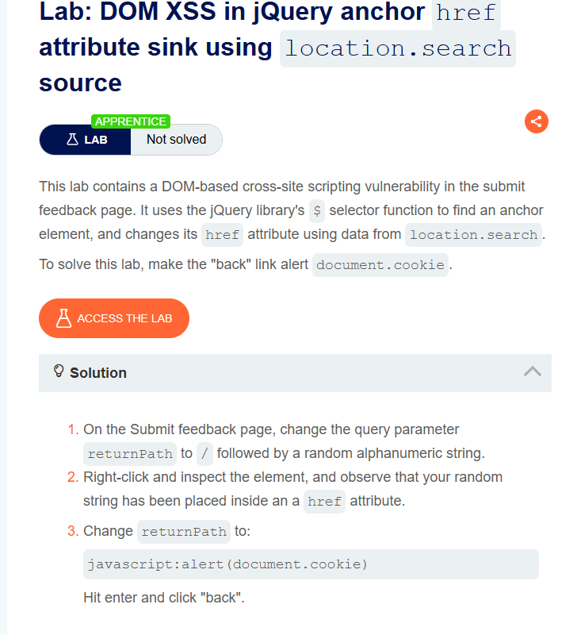

### Exploração

1. Na página de feedback, altere o parâmetro `returnPath` na URL para um valor aleatório e confirme (via inspecionar elemento) que ele aparece dentro do `href` do link "Back".
2. Troque o valor para um payload `javascript:`:
```
?returnPath=javascript:alert(document.cookie)
```
3. Carregue a página e clique no link **Back**.

### Por que funciona
Um atributo `href` que começa com `javascript:` faz o navegador **executar o conteúdo como código** ao invés de navegar para uma URL. Como o site insere o valor da query string direto no `href` sem validar o protocolo, é possível trocar uma URL normal por um payload JS.

✅ **Lab resolvido.**

---

<a name="lab-b"></a>
## 2. DOM XSS in jQuery selector sink using a hashchange event

**Tipo:** DOM-based XSS
**Nível:** Apprentice

### Contexto
A página inicial usa `$()` (seletor jQuery) para rolar a tela até um post específico, cujo título vem de `location.hash` (a parte da URL depois do `#`). Esse valor é lido toda vez que o hash muda (evento `hashchange`), e sem sanitização, pode ser interpretado como um seletor CSS malicioso que injeta HTML.

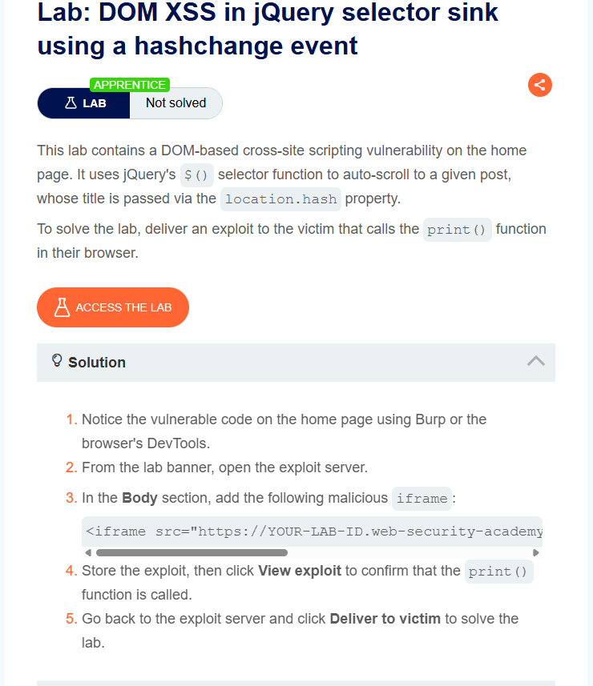

> Esse foi o lab que gerou mais dúvida — vale a explicação com calma.

### Por que precisa de "exploit server" aqui
Diferente dos labs anteriores (onde dava pra mudar a URL e clicar você mesmo), aqui o ataque depende do evento `hashchange` ser disparado **depois** que a página já carregou — e a vítima real nunca vai clicar em um link malicioso pra você. Por isso o lab pede para simular isso através do **exploit server**: um servidor de terceiros que entrega uma página armadilhada pra uma "vítima" automatizada (o navegador de teste do próprio lab).

### Exploração

1. No banner do lab, acesse **"Go to exploit server"**.
2. No campo **Body**, adicione um `iframe` apontando para a página vulnerável, usando um truque de dois passos via `onload`:

```html
<iframe src="https://SEU-LAB-ID.web-security-academy.net/#" onload="this.src+=''">
```

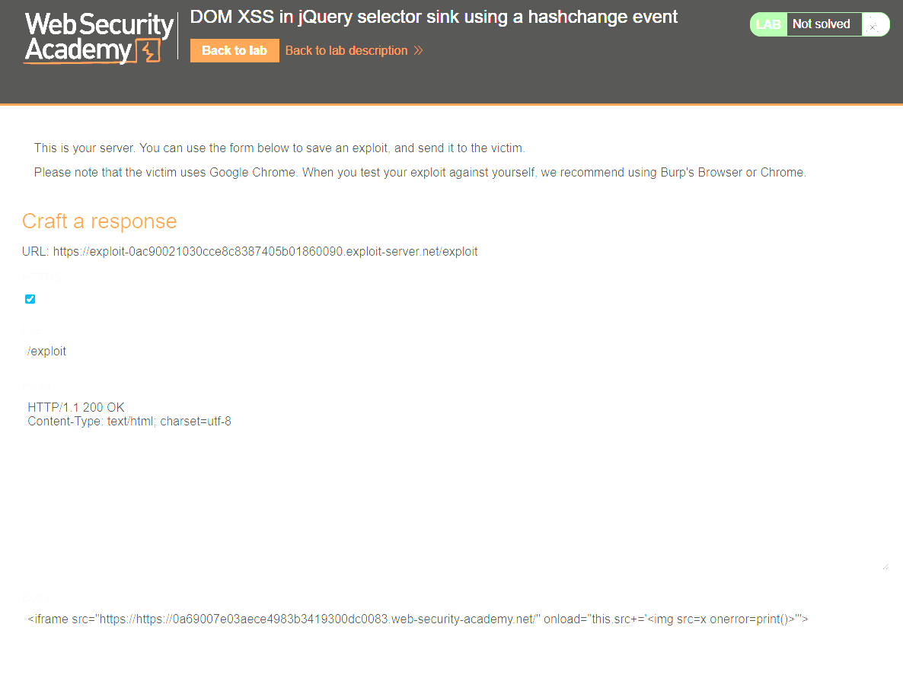

> ⚠️ **Atenção ao montar essa URL**: um erro comum é duplicar o `https://` (ex: `https://https://...`) ao colar o ID do lab — a screenshot acima mostra exatamente esse erro sendo corrigido durante a resolução.

3. Clique em **Store**, depois **View exploit** para confirmar que a caixa de impressão (`print()`) abre.
4. Volte ao exploit server e clique em **Deliver to victim**.

### Como o payload funciona, passo a passo

- `src="https://SEU-LAB-ID.../#"` → o iframe carrega a página vulnerável normalmente, **sem hash** ainda (só um `#` vazio).
- `onload="..."` → só depois que a página termina de carregar (evitando corrida de eventos), o atributo `src` do iframe é **alterado de novo**, dessa vez *acrescentando* `` ao final da URL (viraria algo como `...#`).
- Mudar o `src` do iframe dessa forma, mantendo a mesma origem e só trocando o hash, **dispara o evento `hashchange`** na página já carregada — exatamente o gatilho que o código vulnerável escuta.
- O código da página pega esse novo valor de `location.hash` e usa com `$()` pra tentar achar/rolar até um post com aquele "título". Só que, ao invés de um título de post, o valor é uma tag HTML inteira (``).
- O jQuery, ao receber uma string que começa com `<`, entende como **HTML para criar um elemento novo**, e injeta essa tag na página.
- A tag `` tem um `src` inválido (`x`), então o navegador dispara o evento `onerror` — que executa `print()`.

Resumindo: é um ataque em duas etapas porque o `hashchange` só dispara quando o hash muda *depois* da página já estar carregada — por isso o primeiro `src` é "limpo" e só o `onload` injeta o payload de verdade.

✅ **Lab resolvido.**

---

<a name="lab-c"></a>
## 3. Reflected XSS into attribute with angle brackets HTML-encoded

**Tipo:** Reflected XSS
**Nível:** Apprentice

### Contexto
A busca do blog reflete o termo pesquisado dentro de um atributo HTML entre aspas. Os caracteres `<` e `>` são codificados (não dá pra injetar uma tag nova diretamente), mas as **aspas não são filtradas**.

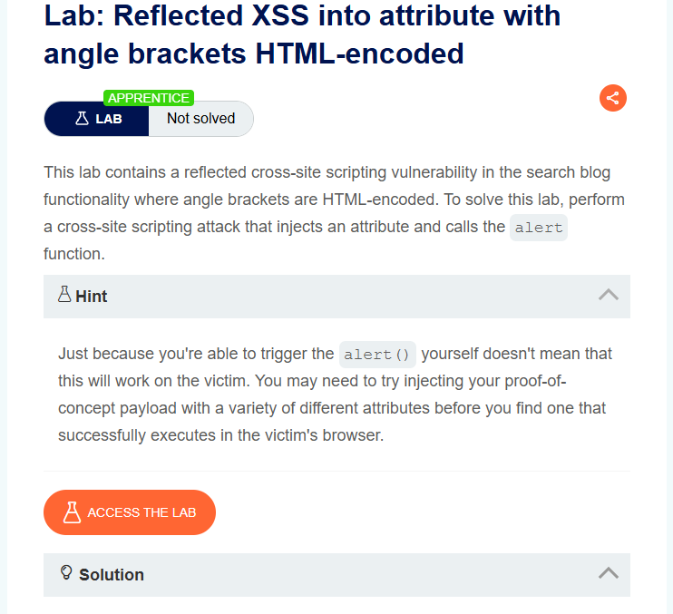
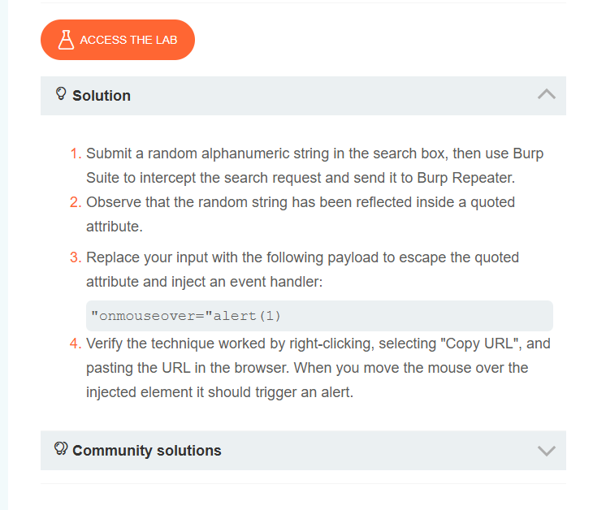

### Exploração

1. Pesquisei um valor aleatório e capturei a requisição no Burp:

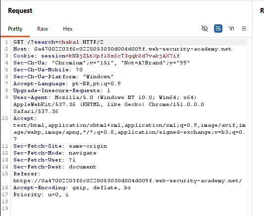

2. Troquei o valor do parâmetro `search` pelo payload que escapa do atributo e injeta um *event handler*:
```
"onmouseover="alert(1)
```
3. Abri a URL resultante e passei o mouse sobre o elemento injetado — o `alert` disparou.

### Por que funciona
Como a aspa (`"`) não é codificada, o payload fecha o atributo original antes da hora (`value="..."`) e declara um **novo atributo** (`onmouseover`) dentro da mesma tag. Isso não precisa de `<` ou `>`, então passa pelo filtro.

✅ **Lab resolvido.**

---

<a name="lab-d"></a>
## 4. Stored XSS into anchor `href` attribute with double quotes HTML-encoded

**Tipo:** Stored XSS
**Nível:** Apprentice

### Contexto
A funcionalidade de comentários do blog salva o campo "Website" e usa esse valor no `href` do link com o nome do autor do comentário. Diferente do reflected, aqui o payload fica **persistido no banco** — qualquer visitante do post é afetado ao clicar no nome.

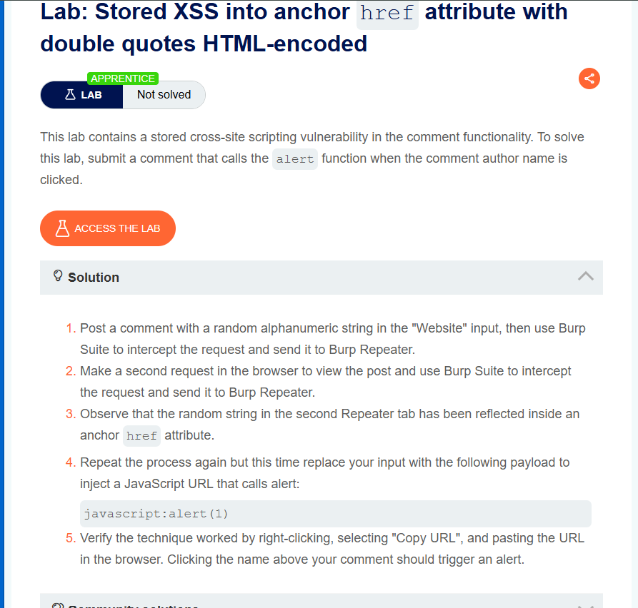

### Exploração

1. Postei um comentário preenchendo o campo **Website** com:
```
javascript:alert(1)
```
2. Enviei o comentário.
3. Cliquei no **nome do autor** do comentário — o link usa o `href` malicioso.

### Por que funciona
Mesma lógica do Lab A (`javascript:` como protocolo do `href`), mas com persistência: o payload fica salvo e é servido pra qualquer um que visite a página e clique no nome — essa é a diferença central entre XSS **refletido** e **armazenado**.

✅ **Lab resolvido.**

---

<a name="lab-e"></a>
## 5. Reflected XSS into a JavaScript string with angle brackets HTML encoded

**Tipo:** Reflected XSS
**Nível:** Apprentice

### Contexto
O termo de busca é refletido dentro de uma **string JavaScript** (não em HTML puro). Os caracteres `<` `>` são codificados, então a injeção precisa quebrar a string JS diretamente, sem usar tags.

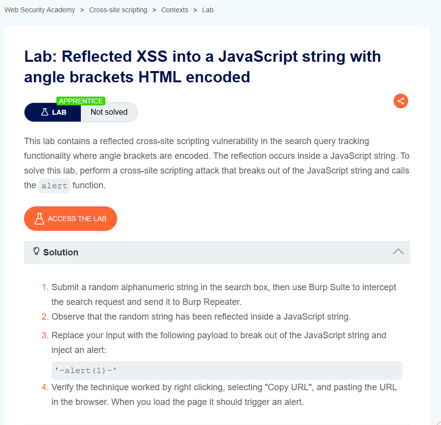

### Exploração

Payload usado:
```
'-alert(1)-'
```

Resultado confirmado direto no Burp (200 OK, alert disparado ao carregar a página):

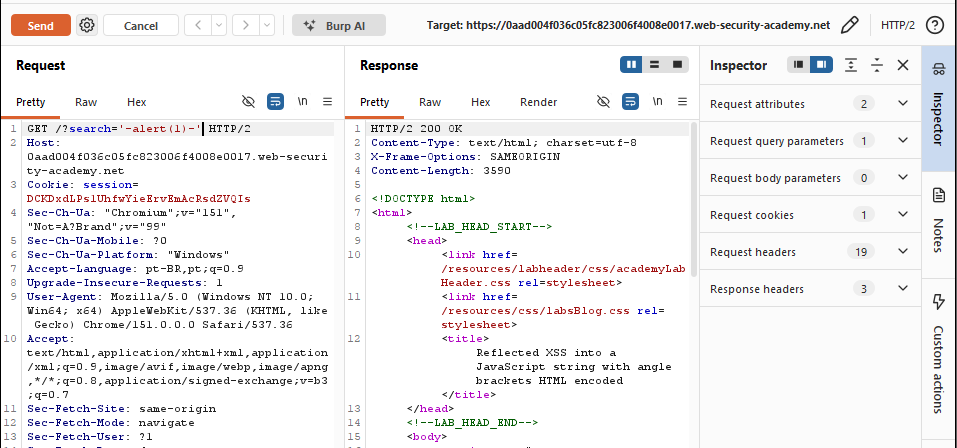

### Por que funciona
A aplicação gera algo como:
```js
var search = 'SEU_TERMO_AQUI';
```
Ao injetar `'-alert(1)-'`, a string vira:
```js
var search = ''-alert(1)-'';
```
O que o JS interpreta como: string vazia `''`, menos `alert(1)` (que executa e retorna `undefined`), menos outra string vazia `''`. É uma expressão aritmética válida que tem o efeito colateral de rodar o `alert`.

✅ **Lab resolvido.**

---

<a name="lab-f"></a>
## 6. DOM XSS in `document.write` sink using source `location.search` inside a `<select>` element

**Tipo:** DOM-based XSS
**Nível:** Practitioner

### Contexto
Na página de produto, o "stock checker" lê o parâmetro `storeId` de `location.search` e usa `document.write()` para montar dinamicamente as `<option>` de um `<select>` — sem escapar o valor.

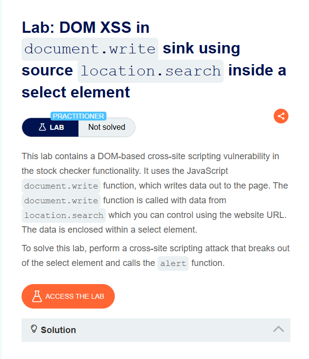
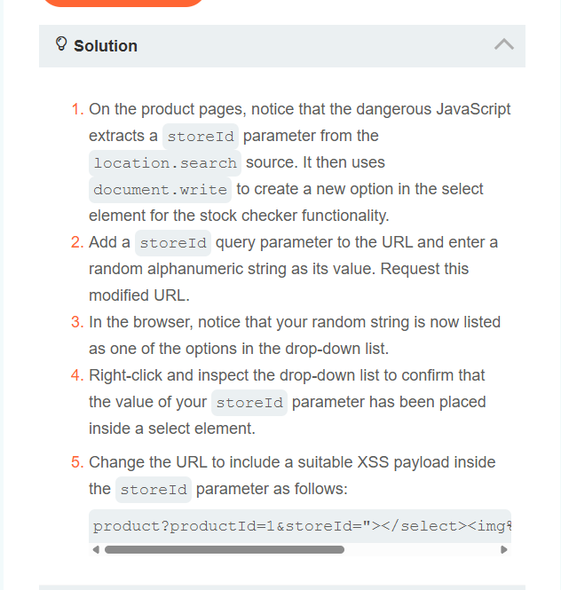

### Exploração

1. Adicionei `storeId` com valor aleatório e confirmei (via inspecionar elemento) que ele era inserido dentro do `<select>`.
2. Troquei para o payload que fecha a tag `<select>` e injeta uma nova tag maliciosa:
```
product?productId=1&storeId="></select>
```

### Por que funciona
`document.write()` escreve HTML bruto na página. Ao fechar o `</select>` manualmente e abrir uma tag `` com `onerror`, o navegador tenta carregar uma imagem inválida (`src=1`) e, ao falhar, dispara o evento `onerror`, executando o `alert`.

✅ **Lab resolvido.**

---

<a name="lab-g"></a>
## 7. DOM XSS in AngularJS expression with angle brackets and double quotes HTML-encoded

**Tipo:** DOM-based XSS (AngularJS sandbox escape)
**Nível:** Practitioner

### Contexto
A busca é renderizada dentro de um elemento com a diretiva `ng-app` do AngularJS. Mesmo com `<` `>` e aspas codificados, o AngularJS processa **expressões dentro de chaves duplas** (`{{ }}`) como código, criando uma via de injeção que não depende desses caracteres.

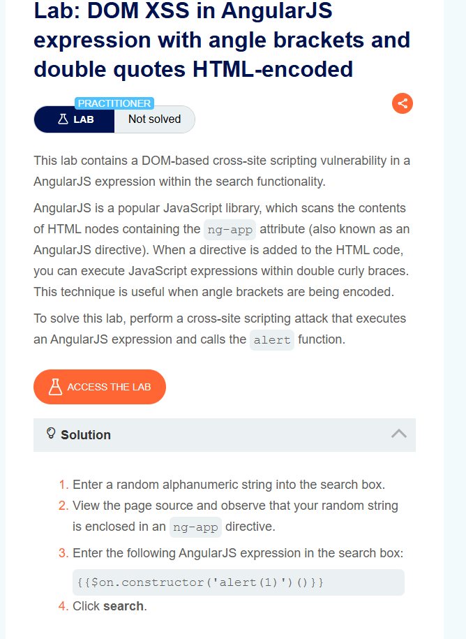

Confirmação do ambiente AngularJS (`ng-app` + `angular-1.7.7.js`) via inspeção do código-fonte:

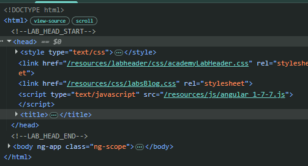

### Exploração

Payload usado na busca:
```
{{$on.constructor('alert(1)')()}}
```

### Por que funciona
- `{{ }}` é a sintaxe de **expressão AngularJS** — tudo dentro é avaliado como código JS pelo framework.
- `$on` é uma função disponível no escopo do Angular.
- `.constructor` de qualquer função em JS é o construtor `Function` — e `new Function('codigo')` cria uma função a partir de uma **string arbitrária**.
- `('alert(1)')` passa o código que queremos executar como string.
- O último `()` **chama** essa função recém-criada, executando o `alert(1)`.

Esse é um clássico **sandbox escape** do AngularJS: usar a própria API do framework para alcançar o construtor `Function` e rodar código arbitrário, contornando o filtro de `<` `>` e aspas.

✅ **Lab resolvido.**

---

<a name="lab-h"></a>
## 8. Reflected DOM XSS (via `eval()` de resposta JSON)

**Tipo:** DOM-based XSS (reflected)
**Nível:** Practitioner

### Contexto
O servidor processa a busca e devolve um JSON com o termo pesquisado. Um script no cliente (`searchResults.js`) pega esse JSON e o processa com `eval()` — um dos *sinks* mais perigosos em JavaScript, pois executa qualquer string como código.

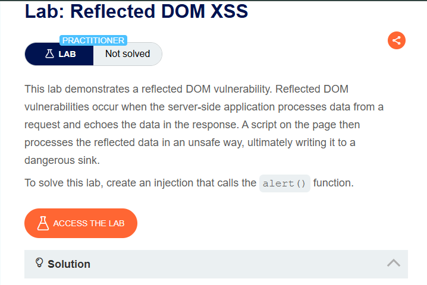
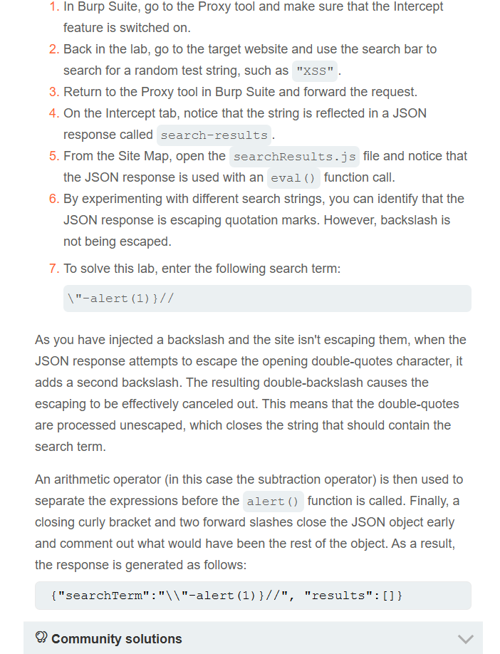

### Investigação

1. Com o Intercept ligado no Burp, fiz uma busca de teste e localizei a resposta JSON refletindo o termo pesquisado.
2. Fui até **Target > Site map**, localizei o arquivo `searchResults.js` e inspecionei o código:

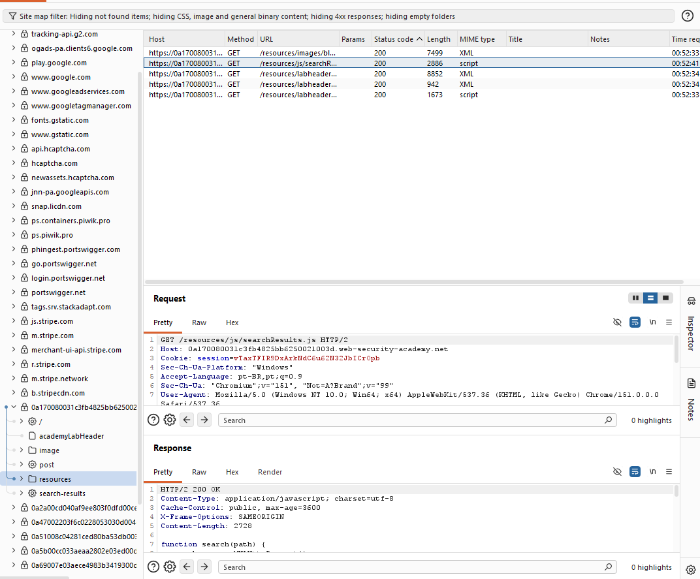

3. O código confirma o uso perigoso de `eval()`:

```js
function search(path) {
    var xhr = new XMLHttpRequest();
    xhr.onreadystatechange = function() {
        if (this.readyState == 4 && this.status == 200) {
            eval('var searchResultsObj = ' + this.responseText);
            displaySearchResults(searchResultsObj);
        }
    };
    xhr.open("GET", path + window.location.search);
    xhr.send();
}
```

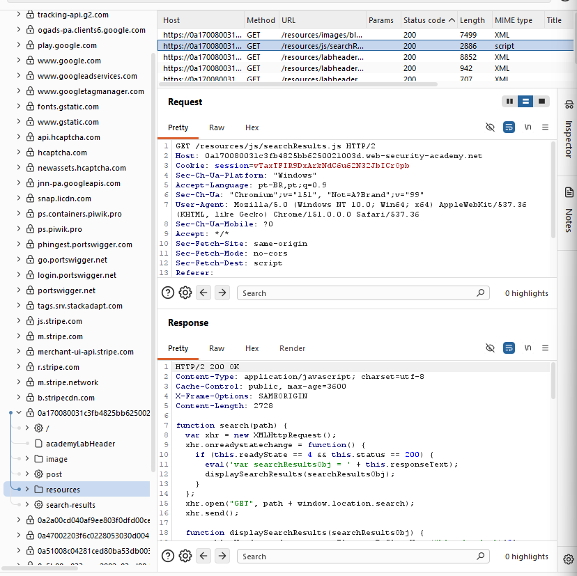

4. Testando diferentes valores, identifiquei que o servidor **escapa aspas duplas**, mas **não escapa barra invertida** (`\`).

### Payload final
```
\"-alert(1)}//
```

### Por que funciona
A resposta normal do servidor seria algo como:
```json
{"searchTerm":"xss", "results":[]}
```

Ao enviar `\"-alert(1)}//` como termo de busca:

- O servidor tenta escapar a aspa dupla do nosso input, adicionando uma barra antes dela (`\"`).
- Só que **nosso input já tinha uma barra antes da aspa**. O resultado vira uma **barra dupla** (`\\"`), que em JavaScript significa "uma barra invertida literal" — **cancelando o efeito de escape** da aspa seguinte.
- Com isso, a aspa dupla volta a funcionar como delimitador de string, fechando o `searchTerm` antes da hora.
- `-alert(1)` é interpretado como expressão aritmética (igual ao Lab E), executando o alert.
- `}` fecha o objeto JSON manualmente.
- `//` comenta o restante da resposta original (`, "results":[]}`), evitando erro de sintaxe.

O resultado final do JSON vira:
```json
{"searchTerm":"\\"-alert(1)}//", "results":[]}
```
...que o `eval()` interpreta como código JS válido, executando o `alert(1)` no meio do caminho.

✅ **Lab resolvido.**

---

## Resumo comparativo

| Lab | Tipo | Sink explorado | Payload-chave |
|---|---|---|---|
| A | DOM | `href` via jQuery | `javascript:alert(document.cookie)` |
| B | DOM | `$()` seletor + `hashchange` | `` (via iframe de 2 passos) |
| C | Reflected | Atributo HTML quotado | `"onmouseover="alert(1)` |
| D | Stored | `href` persistido | `javascript:alert(1)` |
| E | Reflected | String JavaScript | `'-alert(1)-'` |
| F | DOM | `document.write` em `<select>` | `"></select>` |
| G | DOM | Expressão AngularJS | `{{$on.constructor('alert(1)')()}}` |
| H | DOM (reflected) | `eval()` de JSON | `\"-alert(1)}//` |

---

*Writeup gerado a partir da resolução prática dos labs da [PortSwigger Web Security Academy](https://portswigger.net/web-security).*